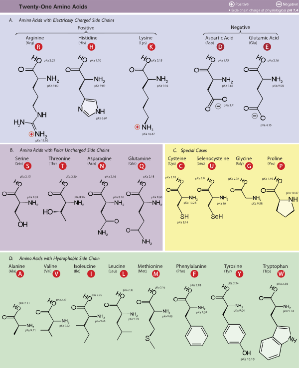

# Amino Acid

## Standard Amino Acid (표준 아미노산)
- 생체 내 단백질 합성에 관여
- :man: : 필수 아미노산 / :baby: : 성장기 한정 필수 아미노산
1. A (Ala / Alanine / 알라닌)
2. R (Arg / Arginine / 아르기닌) :baby:
3. N (Asn / Asparagine / 아스파라긴)
4. D (Asp / Aspartic acid / 아스파르트산)
5. C (Cys / Cysteine / 시스테인)
6. E (Glu / Glutamic acid / 글루탐산)
7. Q (Gln / Glutamine / 글루타민)
8. G (Gly / Glycine / 글리신)
9. H (His / Histidine / 히스티딘) :baby:
10. I (Ile / Isoleucine / 이소류신) :man:
11. L (Leu / Leucine / 류신) :man:
12. K (Lys / Lysine / 라이신) :man:
13. M (Met / Methionine / 메티오닌) :man:
14. F (Phe / Phenylalanine / 페닐알라닌) :man:
15. P (Pro / Proline / 프롤린)
16. S (Ser / Serine / 세린)
17. T (Thr / Threonine / 트레오닌) :man:
18. W (Trp / Tryptophan / 트립토판) :man:
19. Y (Tyr / Tyrosine / 티로신)
20. V (Val / Valine / 발린) :man:
***
21. U (Sec / Selenocysteine / 셀레노시스테인)
22. O (Pyr / Pyrrolysine / 피롤라이신)